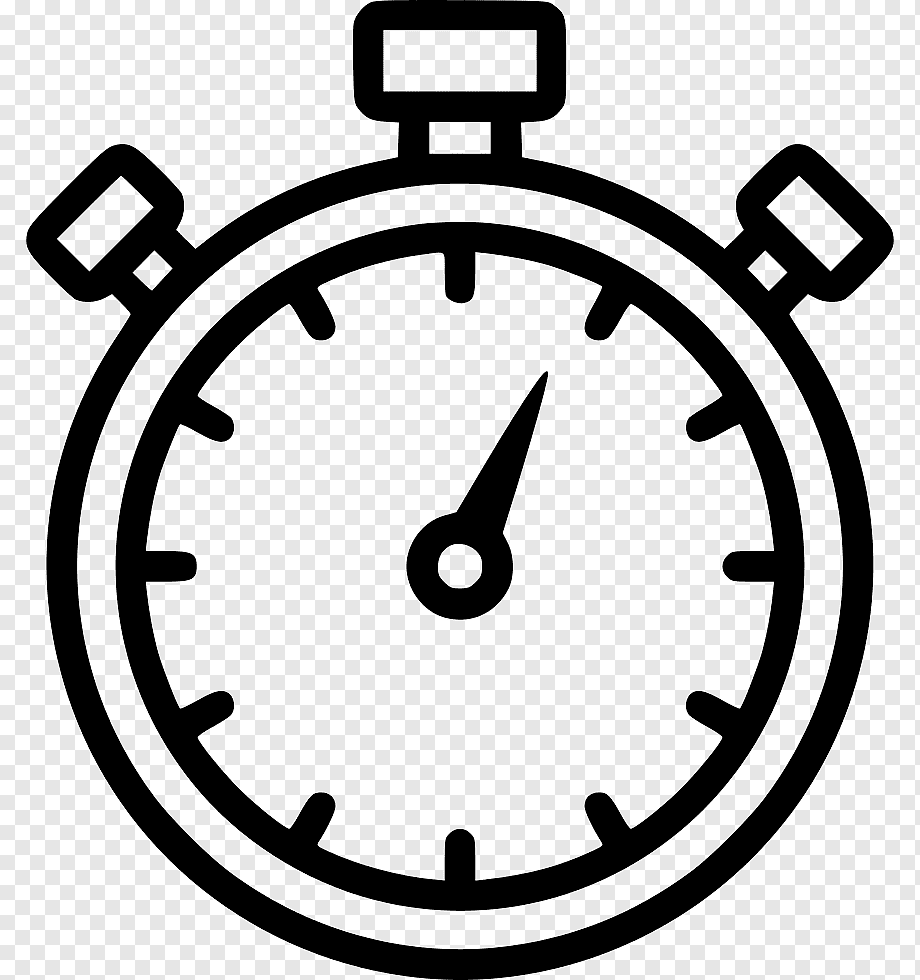
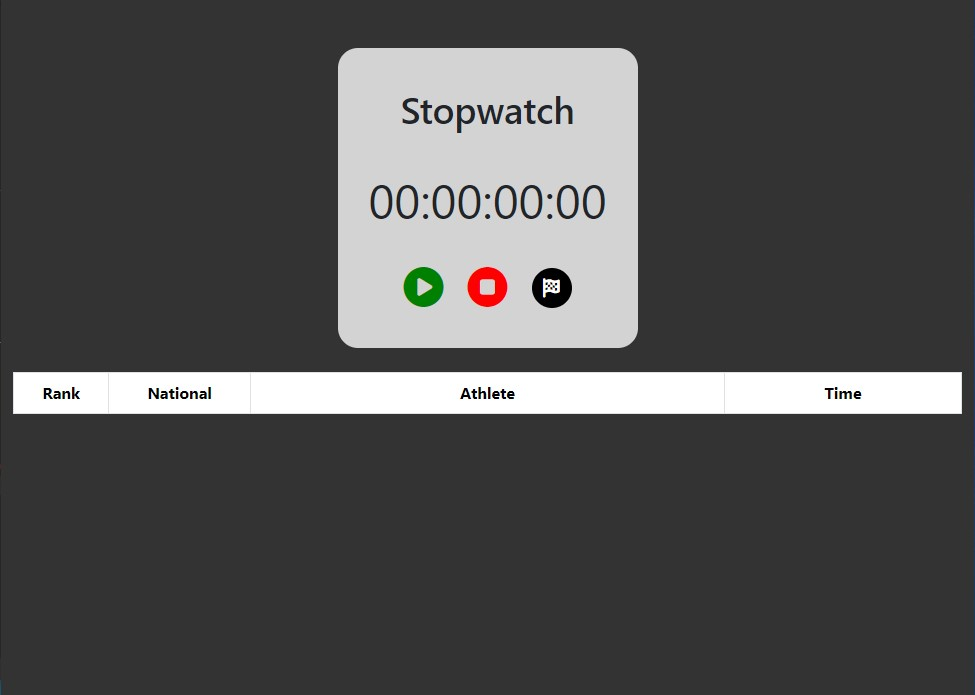
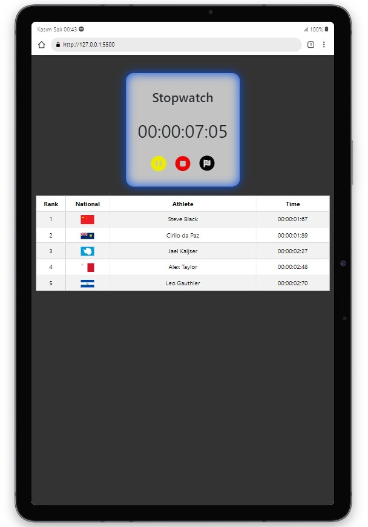
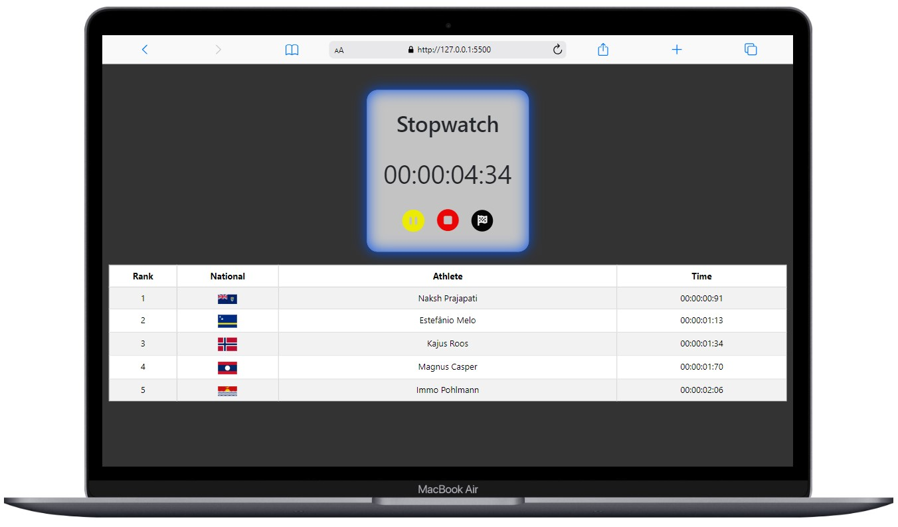
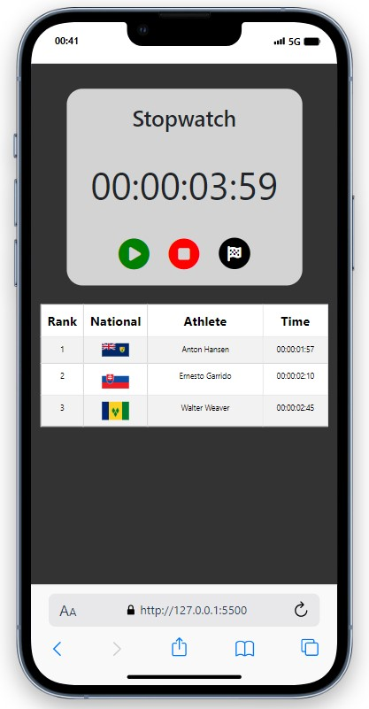
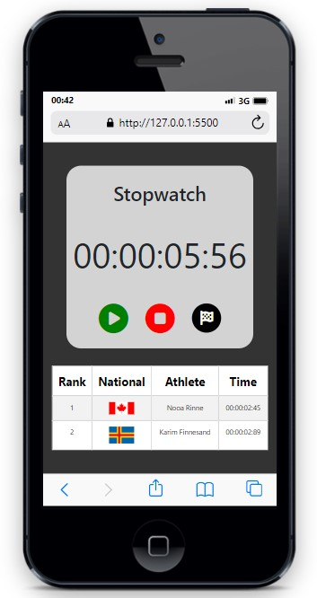

 

  

  <h3 align="center">Stopwatch</h3>

  

   making stopwatches and generating random athletes
     
    <a href="https://vercel.com/mehmet-dogans-projects/stopwatch"><strong>LIVE »</strong></a>
     
  

<!-- ABOUT THE PROJECT -->
## About The Project

 
 
A simple and useful stopwatch has been prepared for you. A button has also been added to the project to simulate the athletes' finishes. Every time you press the button, the athlete names, flags, sequence numbers and stopwatch values are randomly displayed. 

(<a href="#responsive">Go Responsive Designs</a>)

(<a href="#readme-top">back to top</a>)

## Usage
*Using the stopwatch is very simple. It works when you press the play button, stops with the pause button, deletes everything with the reset button, and removes the athletes with the black button.  

## Responsive Designs 📲💻
<!-- Responsive Designs -->

     
     
     
     

